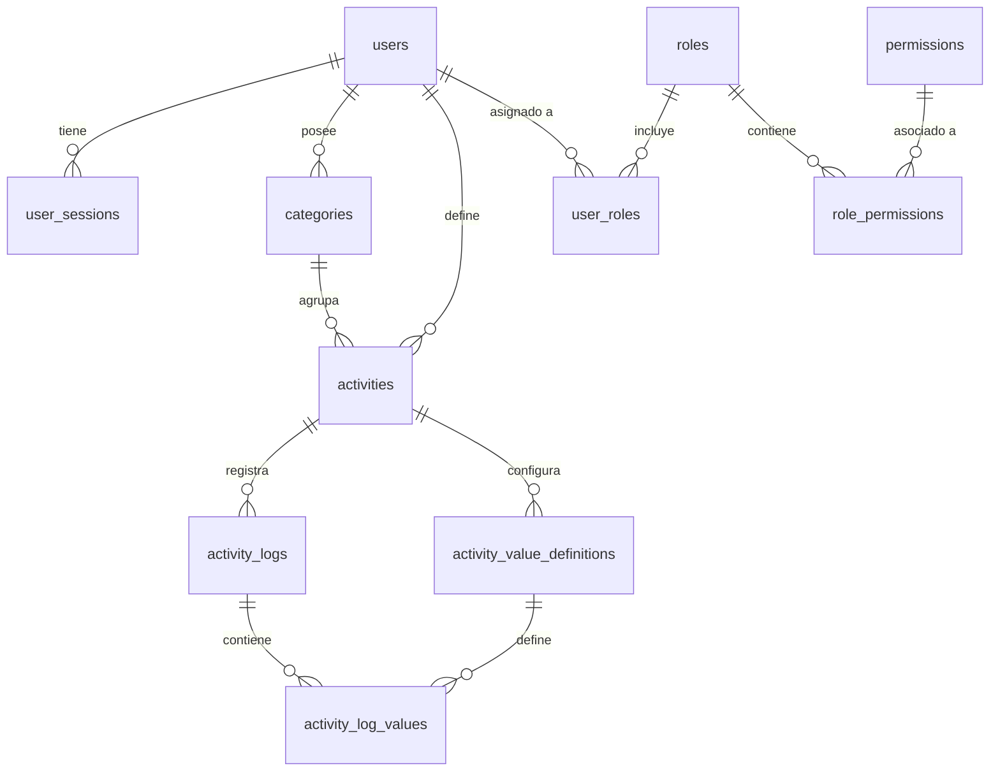

# Documentación de Base de Datos - THtracker

Esta sección contiene la documentación detallada de las tablas de la base de datos, mapeadas desde la capa de Dominio e Infraestructura.

## Diagrama de Entidad-Relación (ERD)

## Tablas Documentadas

1.  **[Users](users_table.md)**: Usuarios centrales del sistema.
2.  **[User Sessions](user_sessions_table.md)**: Gestión de tokens y sesiones activas.
3.  **[Categories](categories_table.md)**: Organización de actividades.
4.  **[Activities](activities_table.md)**: Definición de tareas rastreables.
5.  **[Activity Value Definitions](activity_value_definitions_table.md)**: Configuración de campos personalizados.
6.  **[Activity Logs](activity_logs_table.md)**: Registros de tiempo de actividades.
7.  **[Activity Log Values](activity_log_values_table.md)**: Datos de campos personalizados por log.
8.  **[Roles y Permisos](roles_permissions_tables.md)**: Sistema de control de acceso (RBAC).

## Notas de Implementación
> [!IMPORTANT]
> **Fuente de Verdad**: Aunque el archivo `db.sql` define el esquema inicial, la lógica de generación de identidades (UUID) y marcas de tiempo (`CreatedAt`/`UpdatedAt`) reside principalmente en la **Capa de Dominio e Infraestructura** (Constructores de entidades y configuraciones de EF Core).
